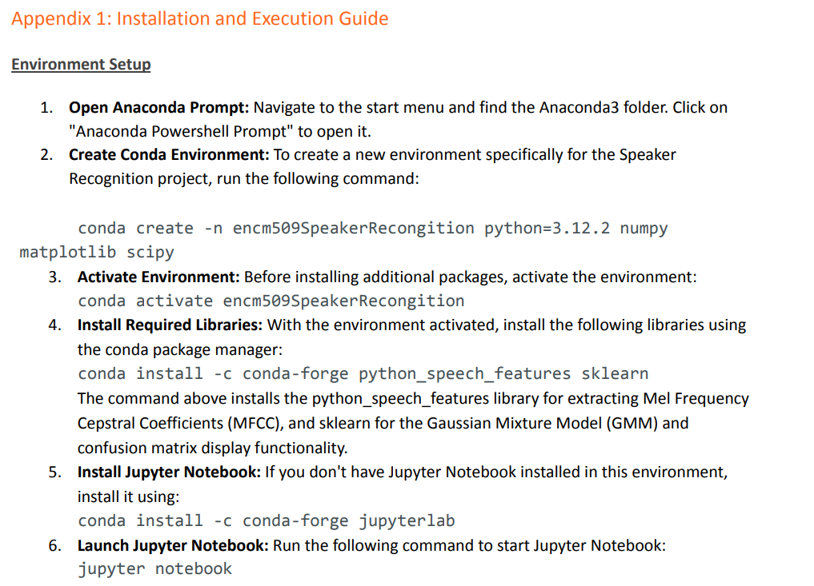
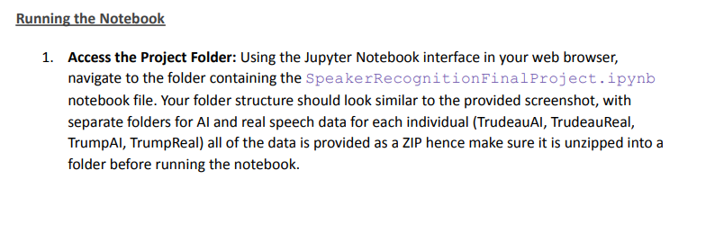
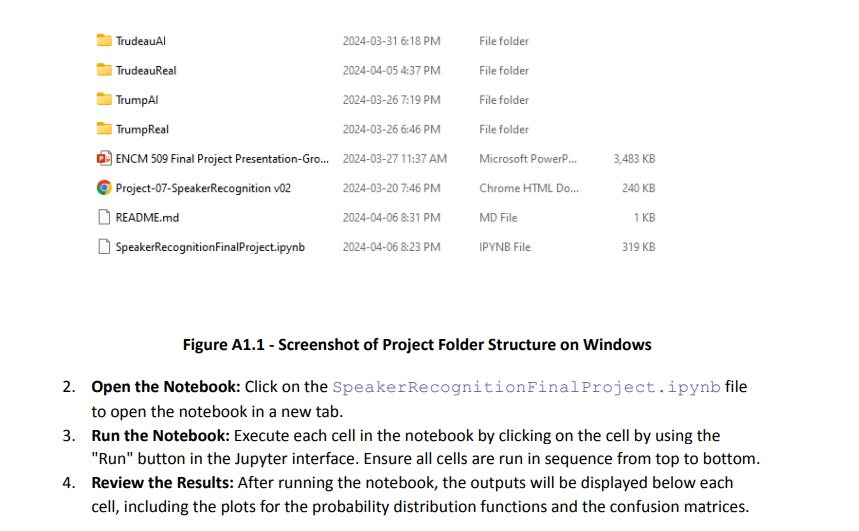

# ENCM 509 Final Project

    	 

By: Mushtaba Al Yasseen, Abhay Khosla and Parbir Lehal
 
## Overview
Welcome to our project repository, where we explore the intersection of artificial intelligence and speech recognition using Gaussian Mixture Models (GMM). The GMM is an exceptional statistical tool that enhances our ability to understand and analyze the complexities of human speech. Our project aims to break down speech into its fundamental components, improving the reliability of speech recognition systems used in everyday technology, from virtual assistants to navigation systems.

## Objective 
The goal of this project is to conduct a thorough investigation of AI-generated speech compared to authentic human speech. We leverage the voices of renowned political figures to test the limits of our GMM-based speech recognition system. By creating a specialized dataset of AI-driven and genuine speeches, we aim to evaluate our model's effectiveness and explore the boundaries between AI and human speech characteristics.

## What's Included: 
- Capture and process audio samples, isolating unique speech features.
- Train and test Gaussian Mixture Models on a diverse dataset of speeches.
- Analyze the performance of our models against AI-generated and authentic speeches.

## Installation Guide and Execution: 

